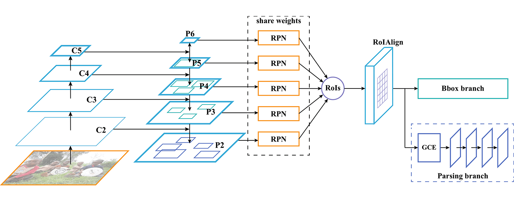
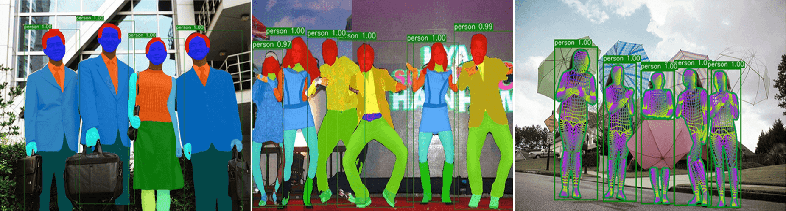

# Parsing-R-CNN
**(New!)** Official implementation of **Parsing R-CNN for Instance-Level Human Analysis (CVPR 2019)**

## Citing Parsing R-CNN

If you use Parsing R-CNN, please use the following BibTeX entry.

```BibTeX
@inproceedings{yang2019cvpr,
  title = {Parsing R-CNN for Instance-Level Human Analysis},
  author = {Lu Yang and Qing Song and Zhihui Wang and Ming Jiang},
  booktitle = {Proceedings of the IEEE Conference on Computer Vision and Pattern Recognition (CVPR)},
  year = {2019}
}

```

In this repository, we release the Parsing R-CNN code in Pytorch.

- Parsing R-CNN architecture:
<p align="center"></p>

- Parsing R-CNN output:
<p align="center"></p>


## Installation
- 8 x TITAN RTX GPU
- pytorch1.1
- python3.6.8

Install Parsing R-CNN following [INSTALL.md](https://github.com/soeaver/Parsing-R-CNN/blob/master/INSTALL.md#install).


## Dataset

You need to download the datasets and annotations following this repo's formate. As:

- [CIHP](https://drive.google.com/open?id=1OLBd23ufm6CU8CZmLEYMdF-x2b8mRgxV)

- [MHP-v2](coming soon)

- [DensePoseData](https://drive.google.com/open?id=1WiTLYVIgMyCDENXHPVEWW7qbZ-3EBjbt)(using original [MSCOCO2017](http://cocodataset.org/#download) images)

And following [Data](https://github.com/soeaver/Parsing-R-CNN/blob/master/INSTALL.md#data-and-pre-train-weights) to train or evaluate Parsing R-CNN models.


## Results and Models

**On CIHP val**

|  Backbone  |  LR  | Det AP | mIoU |Parsing (APp50/APvol/PCP50) | DOWNLOAD |
|------------|:----:|:------:|:----:|:--------------------------:| :-------:|
|  R-50-FPN  |  1x  | 65.8   | 52.8 |      57.2/51.2/55.4        |          |
|  R-50-FPN  |  3x  | 68.7   | 56.0 |      64.1/54.1/60.7        | [GoogleDrive](https://drive.google.com/open?id=16bASrD7AoCADKzXynIgmdyzmbuzCfAUL)|


**On MHP-v2 val**

|  Backbone  |  LR  | Det AP | mIoU |Parsing (APp50/APvol/PCP50) | DOWNLOAD |
|------------|:----:|:------:|:----:|:--------------------------:| :-------:|
|  R-50-FPN  |  1x  | 66.5   | 34.0 |      19.9/36.7/32.4        |          |
|  R-50-FPN  |  3x  | 69.0   | 36.1 |      27.4/40.5/38.3        | [GoogleDrive](https://drive.google.com/open?id=1rbSNP4_DoJdNK4l6KHrthO0x4WOFgHGy)|


**On DensePose_COCO val**

|  Backbone  |  LR  | Det AP |UV AP (AP/AP50/AP75/APm/APl)| DOWNLOAD |
|------------|:----:|:------:|:--------------------------:| :-------:|
|  R-50-FPN  |  s1x | 57.4   |  59.3/90.5/68.7/56.2/60.8  | [GoogleDrive](https://drive.google.com/open?id=1YQygKoOb5SbZWYnF7f9vEpC_NenpMhH5)|


- New metric GPSm is adopted for evaluating UV


**ImageNet pretrained weight**

- [R-50](https://drive.google.com/open?id=1EtqFhrFTdBJNbp67effArVrTNx4q_ELr)
- [R-50-GN](https://drive.google.com/open?id=1LzcVD7aADhXXY32DdtKhaY9hTXaduhlg)
- [X-101-32x8d](https://drive.google.com/open?id=1c4OSVZIZtDT49B0DTC0tK3vcRgJpzR9n)


## Visualization

coming soon.


## Training

To train a model with 8 GPUs run:
```
python -m torch.distributed.launch --nproc_per_node=8 tools/train_net.py --cfg cfgs/CIHP/e2e_rp_rcnn_R-50-FPN_3x_ms.yaml
```


## Evaluation

### multi-gpu evaluation,
```
python tools/test_net.py --cfg ckpts/CIHP/e2e_rp_rcnn_R-50-FPN_3x_ms/e2e_rp_rcnn_R-50-FPN_3x_ms.yaml --gpu_id 0,1,2,3,4,5,6,7
```

### single-gpu evaluation,
```
python tools/test_net.py --cfg ckpts/CIHP/e2e_rp_rcnn_R-50-FPN_3x_ms/e2e_rp_rcnn_R-50-FPN_3x_ms.yaml --gpu_id 0
```


## License
Parsing-R-CNN is released under the [MIT license](https://github.com/soeaver/Parsing-R-CNN/blob/master/LICENSE).
